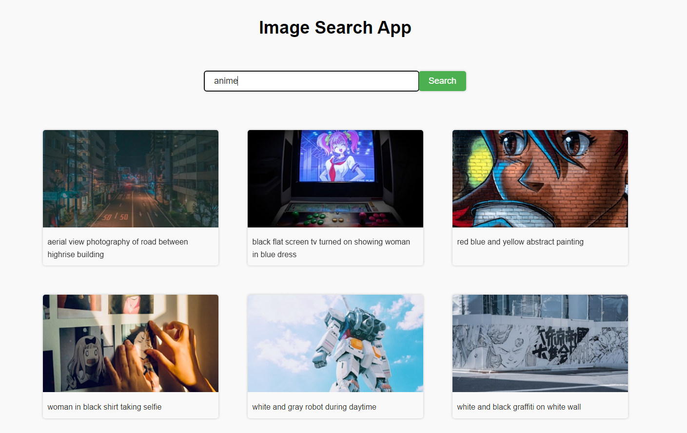

# 🌄 Image Search App

A simple and responsive web application that lets users search for images using the Unsplash API. Built with **HTML**, **CSS**, and **JavaScript**, this project demonstrates dynamic DOM manipulation, API integration, and basic front-end development practices.

---

## 🔍 Features

- 🔎 Search for images by keyword
- 🖼️ View image previews with links to the original source
- ➕ "Show More" button to load additional results
- 📱 Responsive layout for various screen sizes

---

## 🛠️ Tech Stack

- HTML5
- CSS3
- JavaScript (Vanilla)
- [Unsplash API](https://unsplash.com/developers)

---

## 📦 How to Run Locally

1. Clone this repository:
   ```bash
   git clone https://github.com/yourusername/image-search-app.git
   ```
2. Navigate into the project folder:
   ```bash
   cd image-search-app
   ```
3. Open `index.html` in your browser.

> ⚠️ Make sure to add your **Unsplash Access Key** in `index.js` if you're using the API.

---

## 📸 Screenshot

> 

---

## 📄 License

This project is licensed under the [MIT License](LICENSE).

---

## 🙌 Acknowledgements

- [Unsplash](https://unsplash.com) for providing a free and open API for images.
